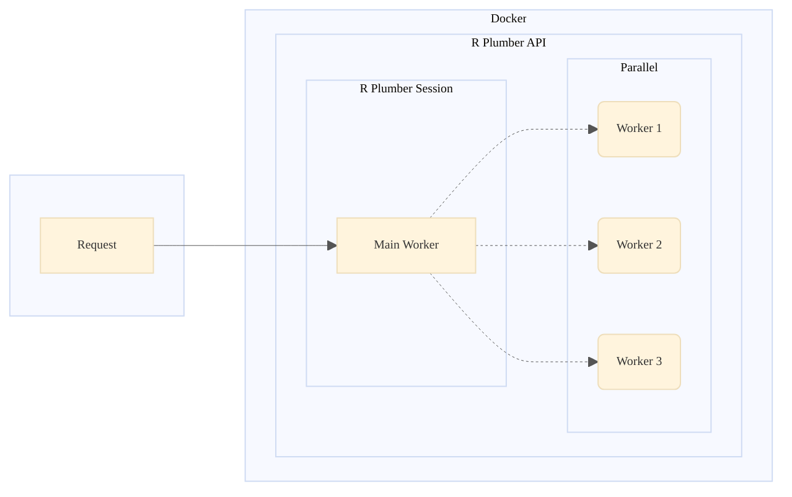

# R Plumber API Templates

## Features

This repository is a boilerplate to setup a new project with R plumber. You can use or customize the code provided in this repository for your own purposes. The features included in this templates are:

| Features                   | Implemented | Description                                                                                                                                                                                                     |
| -------------------------- | :---------: | --------------------------------------------------------------------------------------------------------------------------------------------------------------------------------------------------------------- |
| Logging                    |     ✅      | Better way to log any incoming request to stdout and file with `logger` package                                                                                                                                 |
| Error Handling             |     ✅      | Proper & simple error handling with custom HTTP Response code                                                                                                                                                   |
| File Based Routing         |     ✅      | Auto mount route file from `routes` dir with file name based endpoint                                                                                                                                           |
| Dynamic Filter/Miiddleware |     ✅      | Add custom filter / middleware each mounted route from `routes` dir                                                                                                                                             |
| Request Validation         |     ✅      | Simple validation mechanism to check incoming request from request body / params, such as required fields, check type (number, boolean, array), check the value in given array, etc.                            |
| Docker                     |     ✅      | Simplifying apps with docker, for better development, deployment, dependencies management, and scaling                                                                                                          |
| Parallel Processing        |     ✅      | R only run a request at a time, make it process in parallel with `promises` and `future` packages.                                                                                                              |
| Testing                    |     ✅      | Testing for endpoints / routes and helper functions with `testthat` and `httr` packages, also use Docker and docker-compose for setting up automated testing. For running in CI / CD, an example also provided. |

This template comes with built in Environment Variables that you can edit when running it.

| ENV       |   Default   | Description                                                                                    |
| --------- | :---------: | ---------------------------------------------------------------------------------------------- |
| `HOST`    | `127.0.0.1` | Host to run Rplumber, use `0.0.0.0` when running it in Docker                                  |
| `PORT`    |   `8000`    | Which port Rplumber will run                                                                   |
| `WORKERS` |     `3`     | Number of worker (Rsession) to run parallel processing in Rplumber (including the main worker) |

## How to use it

To use this templates, you must have Docker installed, I am prefer using docker because it's simple and can run anywhere, just build and run. If you not using docker you can run it manullay from `Rstudio` or any IDE you like by using this command `Rscript app.R` in the project dir, and make sure you have installed all the dependecies / packages before running it.

```bash
docker build -t "r-plumber:latest" .

docker run -d --name "r-plumber" -e "HOST=0.0.0.0" -p 8000:8000 r-plumber:latest
```

> Note that, if you made changes to your project, you must restart the container or running it again.

### Routing

I am using the term `route` for the `*.R` files in `routes` dir, and `enpoint` for any function inside it. To create a new route or endpoint, just create a `*.R` file in `routes` dir with `roxygen2` like comment or annotation like this.

```r
# routes/example-route.R

#* Return a message
#* @param msg The message to echo
#* @serializer unboxedJSON
#* @get /
function(msg="") {
  list(msg = paste0("The message is: '", msg, "'"))
}

#* Return a hello message
#* @serializer unboxedJSON
#* @get /hello
function(msg="") {
  list(msg = 'Hallo from /hello endpoint')
}
```

And this will generate `GET /example-route/` and `GET /example-route/hello` endpoints. Read more about it from the [docs](https://www.rplumber.io/)

### Filter or Middleware

Middleware or Filter is the "same term" to describe something in beetween before the request come to controller. To use filter, add this following code to your routes.

```r
# routes/custom-filter/enable.R

#* @plumber
function(pr) {
  pr %>%
    pr_filter("custom-filter", function(req, res) {
      log_info("CUSTOM FILTER CALLED")
      plumber::forward()
    })
}
```

The second params is your filter function, you can create it directly or create global function in helpers (but don't forget to import it). Now any endpoint in `/routes/custom-filter/enable.R` will run the filter function, but the other routes doesn't. By using this method, we can use filter as many as we need for each routes.

### Request Validation

We validate the request using custom function from [`helpers/validator.R`](./helpers/validator.R), you can take a look to the example in this endpoint [`routes/validation.R`](./routes/validation.R)

### Parallel Processing

Parallel processing in Rplumber use `future` and `promises` packages, that package will process incoming request in another Rsession called worker.



Use this method for long process endpoints that takes too much time, so the API can continue processing incoming requests even while working on others. You can add to any endpoint like this

```r
# routes/task.R

#* slow endpoint with promise
#* @serializer unboxedJSON
#* @get /slow-with-promise
function(req, res) {
  future_promise({
    # your long procesing task
    Sys.sleep(10)
    return(list(message = "Slow with promise endpoint"))
  })
}
```

### Testing

This project use another approach to run testing with `testthat` package. `testthat` used to test R packages, but we used in this project for running the test manually with help of docker and docker-compose. In [`docker-compose.test.yaml`](./docker-compose.test.yaml) we setup 2 services, the API and the test, both using the same docker images. First we run the API then the test. To run this, use this command so after the test completed all the container will be stopped.

```bash
docker compose -f "docker-compose.test.yaml" up  --abort-on-container-exit --exit-code-from test --attach test
```

For running this in CI / CD, an example is provided in this [github-actions](./.github/workflows/test.yml). The result of this test will be printed out in docker-logs

Some of the examples of test case can be found in the form of `test-*.R` files in `test` directory. You can create your own test cases by creating the `test-*.R` files in that directory and follow the [`testthat` documentations](https://testthat.r-lib.org). Note that, `test` prefix is required in file name and the files cannot be located in the subdirectory as `testthat` does not support it yet.

## Deploy

Deploying docker images it’s easy, you can deploy it like other images in Kubernetes, Docker Swarm, Cloud in GCP / AWS, or a VPS. If you wanna check this boilerplate, you can deploy to Railway by clicking this button below, just for example.

[](https://railway.app/template/Sjd0PA?referralCode=O5j9Uf)

## Last...

Happy coding...
